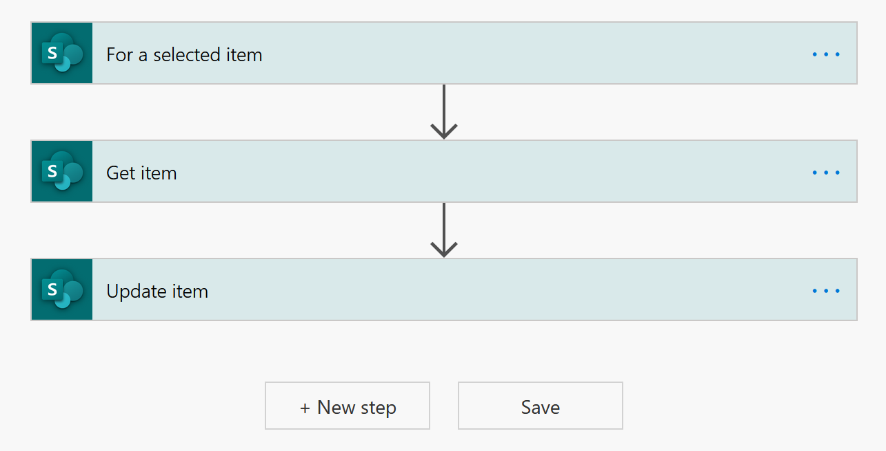
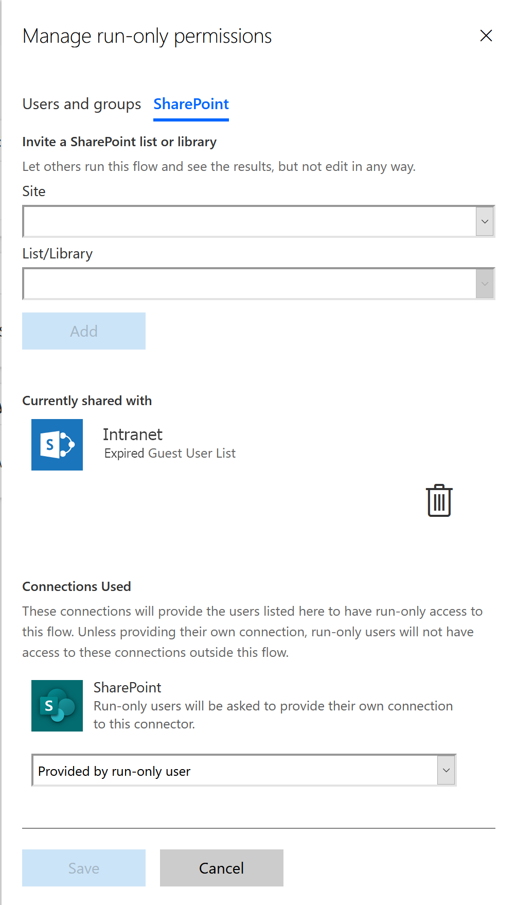
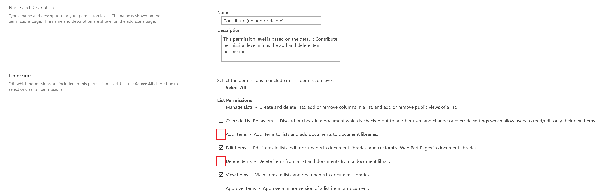

## Guest User LifeCycle Management Tool

### Summary

This document is about managing Microsoft 365 Azure B2B Guest Users using a Azure DevOps YAML pipeline.

This document will give manual instructions on adding prerequisite assets to your Microsoft Cloud environment which you can convert to scripted instructions and place in your forked (or another of your choosing) Configuration-as-Code repository.

### Known Issues

None

### Requirements

* Your own Azure DevOps organization, preferably linked to your Azure AD organization.
* If the PowerShell script `Scripts\M365\3. Governance\_GuestUserLifeCycleManagement\Apply-GuestUserLifeCycle.ps1` needs to be run locally:
  * Only Windows 7+ with WMI 5.1 and .NET Framework 4.6.1+ is supported (Prefer Windows 10)
  * [PnP PowerShell](https://github.com/pnp/PnP-PowerShell#installation) module needs to be installed
  * [Azure AD Preview](https://www.powershellgallery.com/packages/AzureADPreview/2.0.2.105) module needs to be installed
  * [Exchange Online PowerShell V2](https://docs.microsoft.com/en-us/powershell/exchange/exchange-online-powershell-v2?view=exchange-ps#install-and-maintain-the-exchange-online-powershell-v2-module) module needs to be installed  
* If you intend to use the 'Cert' method for authenticating:
  * Make sure you have [previously executed](README.md#add-certificates-and-credentials) the procedure for using the repository and pipeline in your own solution

### Installation

You could create a custom app with some sort of database that will allow to store expired accounts and add a way to reactivate them by a Guest Inviter.

I choose to have SharePoint Online set up to do exactly that.

#### Add SharePoint artifacts and permissions

* (optional) a **new** *SharePoint Site* containing all further assets
  * but you could also use the Root site collection at https://[myclient].sharepoint.com
* a new *SharePoint List* called 'Expired Guest User List'
  * rename the 'Title' column to 'User Principal Name'
  * add a Choice column named 'Reactivate ', options: 'Yes','No', default = 'No'
  * add a Single line of Text column named 'Button'
  * Configure the Button field with a CustomFormatter that will trigger the Power Automate Flow below as shown [here](https://docs.microsoft.com/en-us/sharepoint/dev/declarative-customization/column-formatting#create-a-button-to-launch-a-flow)
* a new [*Power Automate Flow*](https://emea.flow.microsoft.com) called 'Start Expired Guest User Reactivation'
  * with a SharePoint Online 'For a selected item' trigger
  * with an 'Update Item' action that will change the value of the 'Reactivate' column to 'Yes'
  

You have the means to set up security on both the Flow as the SharePoint List.

1. For the Flow I would recommend adding the SharePoint List itself as a run-only user. That way everybody with Access to the list can start a flow (but not edit the flow)

1. For the SharePoint List I would recommend the Guest Inviters have contribute access to the list but remove the 'Add' and 'Delete' permissions by creating a separate [permission level](https://docs.microsoft.com/en-us/sharepoint/understanding-permission-levels) for the site and apply it to a group assigned to the list.

#### Adjust Source Files

Update the 3 empty 'placeholder' functions in `Scripts\M365\PnP-HelperFunctions.ps1` to your liking so they will perform their function of fetching and manipulating items in the SharePoint List.

1. `Add-GuestExpirationToSharePointList`
1. `Get-GuestReactivationsFromSharePointList`
1. `Remove-GuestFromSharePointList`

Tip: to connect to SharePoint-Online use the built-in function `Connect-PnPSpo $global:ServiceConnectionMethod.PnPSpo`
{: .notice--success}

### Execute

If you followed instructions from 
