

## Configuration as Code - Azure DevOps Pipeline for Microsoft 365 - Starter

### Summary

This repo brings you an expandable scaffold for continuously deploying your Microsoft 365 SaaS Configuration with a basic 'conditional' multi stage YAML pipeline for Azure Pipelines. The pipeline uses a manual Approval step, before creating a release. This pipeline simply automates a connection to SharePoint Online by using PnP PowerShell and can than be expanded upon.

To keep things simple:

1. Git branching is not being used, all commit/push actions should take place on the 'master' branch. Adapt this solution accordingly.
1. You can use two methods of authentication in connecting to SharePoint Online:
    1. The **'Cred'** username/password method only
    2. the **'Thumb'** App Only method requiring the full certificate in the Windows Certificate Store.
    3. the **'PfxFile'** App Only method having the pfx certificate on disk, which is recommended for production use.

The steps of generating an App Principal for App-Only operations on SharePoint Online has been inspired by [Cyberdrain](https://www.cyberdrain.com/connect-to-exchange-online-automated-when-mfa-is-enabled-using-the-secureapp-model/) (amongst others).

### Known Issues

None

### Requirements

* Your own Azure DevOps organization, preferably linked to your Azure AD organization.
  * NOTE: You could also use GitHub, GitLab etc. to host your code but you will need to use a different pipeline than the one provided
* These Azure DevOps extensions installed in your Azure DevOps organization:
  * 1 [Tag\Branch Git on Release](https://marketplace.visualstudio.com/items?itemName=jabbera.git-tag-on-release-task&targetId=1984fc0e-1ed4-4122-8e14-c4622047929a&utm_source=vstsproduct&utm_medium=ExtHubManageList)
  * 2 [Generate Release Notes (Crossplatform)](https://marketplace.visualstudio.com/items?itemName=richardfennellBM.BM-VSTS-XplatGenerateReleaseNotes&targetId=1984fc0e-1ed4-4122-8e14-c4622047929a&utm_source=vstsproduct&utm_medium=ExtHubManageList)
  * 3 [WIKI Updater Tasks](https://marketplace.visualstudio.com/items?itemName=richardfennellBM.BM-VSTS-WIKIUpdater-Tasks&targetId=1984fc0e-1ed4-4122-8e14-c4622047929a&utm_source=vstsproduct&utm_medium=ExtHubManageList)
* If the included PowerShell scripts need to be run locally:
  * This scaffold in cross-platform compatible using [PowerShell 7+](https://docs.microsoft.com/en-us/powershell/scripting/install/installing-powershell?view=powershell-7.2):
    * Windows 7+ is supported (Windows 10 is recommended)
    * Linux and MacOS are also supported
  * [Azure CLI](https://docs.microsoft.com/en-us/cli/azure/install-azure-cli) needs to be installed
  * [PnP.PowerShell](https://pnp.github.io/powershell/articles/installation.html) module needs to be installed
* If you intend to use either the 'PfxFile' or 'Thumb' method for authenticating:
  * Make sure you have access to an account with the 'Global Administrator' role as we will need its consent.

### Installation

1. Start by importing this GitHub repository in any Azure DevOps repository you desire to start using your scaffold.

#### Adjust Source Files

1. For both the 'Environment files': `_Environment_PROD.jsonc` and `_Environment_TEST.jsonc` files:
    * at least adjust the `environmentMain.customerName`, `environmentMain.customerPrefix`, `environmentMain.customerO365TenantPrefix`, `environmentMain.customerO365GroupsAcceptedEmailDomain`, `environmentMisc.credentialTarget`, `environmentMisc.credentialGraphTarget`,`environmentMisc.AzureADTenantId` keys matching your environment.
    * review your desired default authentication method used by setting the key `environmentMisc.ServiceAuthenticationSchemes.default` to the 'PfxFile' (Default+Recommended), 'Thumb' or 'Cred' value.

#### Add Certificates and Credentials

Decide if you want to connect to SharePoint Online using the **'Cred'** (username/password) option OR either the **'PfxFile'** or **'Thumb'** App-Only method (recommended).

No matter if you intend to use *only* the **'Cred'** method for authenticating to SharePoint Online (for which you will need an account with the SharePoint Administrator AND Cloud Administrator or Application Administrator role) it is required to add the Global (Company) Administrator role to this account and use that account for setting things up.

##### Step One

###### Windows - 'Cred' authentication

Add the credential you wish to use for initial set-up as the **Generic Windows Credential** you specified as a value for the `environmentMisc.credentialTarget` key above.

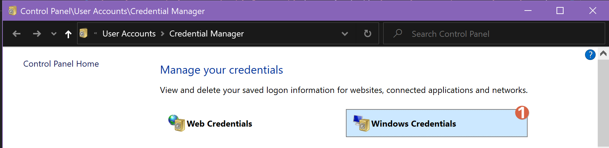
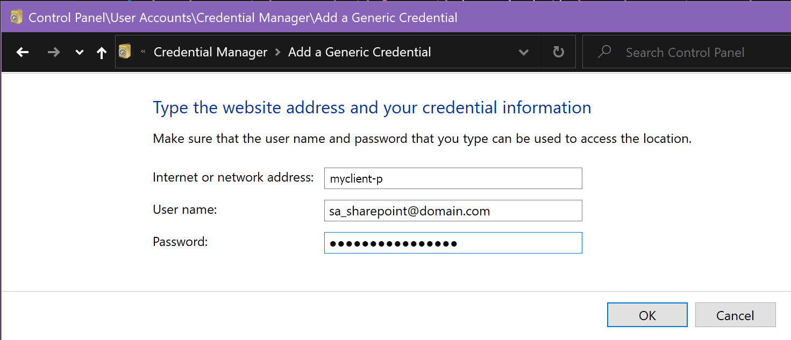

1. Internet or network address: [value specified for key `environmentMisc.credentialTarget` in jsonc file]
1. User name: USERNAME -> sa_sharepoint@domain.com
1. Password: PASSWORD -> [chosen password]

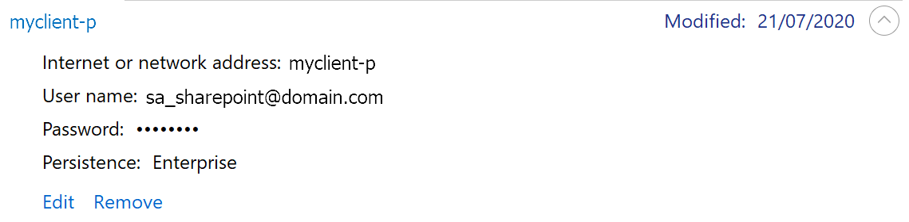

###### MacOS/Linux - 'Cred' authentication

Add the credential you wish to use for initial set-up as global variables to your PowerShell 7+ (pwsh) session:

`$env:DSTCREDS_USERNAME = Read-Host "Enter username"`

`$env:DSTCREDS_PASSWORD = Read-Host "Enter password"`

> **Note:** You could use your own GnuPG method of supplying and storing these values.

##### (Optional) Step Two

For 'Cred' use only you are now done. Continue on if you intend to use either the **'PfxFile' or 'Thumb'** methods ('PfxFile' method is highly recommended). You will need to generate an App Principal with the right API permissions granted AND a certificate for use with the Principal.

Make sure you complete Step One first. During App 'creation' the scripted process will try to give 'admin consent' for the app on the organization level. Therefore **Global (Company) Administrator** role privileges are required for this step and thus for the account used in Step One (recorded in the `environmentMisc.credentialTarget` key Environment files). You can later remove this role from this account.

Please run the script `Scripts\M365\1. Prerequisites\Install-AzureADAppPrincipals.ps1` on a local machine for each environment and follow onscreen instructions exactly.

> **Important:** After running the script you have now obtained the CLIENTID, SECRET, THUMB, PFXPASS variables and a PFX certificate file stored here: `Scripts\M365\[OrgPrefix]-[ClientId]-[Environment].pfx`. This certificate has been configured on the App in Azure AD as well. **Store Safely!**

###### Windows: 'PfxFile' or 'Thumb' authentication

Now find or add the Generic Credential in the Windows Credential Manager which will contain the App Principal details.

1. Internet or network address: [value specified for key `environmentMisc.credentialGraphTarget` in jsonc file]
1. User name: CLIENTID
1. Password: THUMB|PFXPASS|SECRET

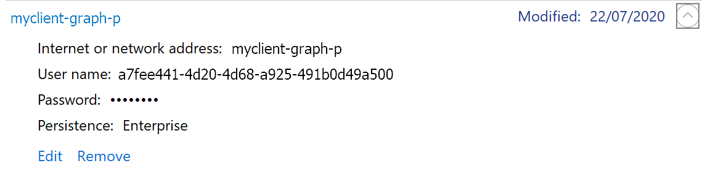

> **Note:** The 'Password' for the Credential is indeed the concatenated value of the **ApplicationCertThumb** value, the **ApplicationCertPfxPassword** value and the **ApplicationSecret** value with a pipe (i.e. '|') character in between. If you do not have one of the values make sure the string 'format' is maintained.

###### MacOS/Linux: 'PfxFile' or 'Thumb' authentication

In addition to the credential variables you used for initial set-up add these extra global variables to your PowerShell 7+ (pwsh) session any time you wish to authenticate using an App:

`$env:DSTCREDS_CLIENTID = Read-Host "Enter the App ID or Client Id for the App"`

`$env:DSTCREDS_THUMB = Read-Host "Enter the Certificate Thumbprint for the app certificate"`

`$env:DSTCREDS_PFXPASS = Read-Host "Enter the Certificate PFX File password for the app certificate"`

`$env:DSTCREDS_SECRET = Read-Host "Enter the Certificate Client Secret for the app certificate"`

`$env:DSTCREDS_PFXFILE = Read-Host "Enter the Certificate PFX file path for the app certificate"`

> **Note:** You could use your own GnuPG method of supplying and storing these values.

##### Ready for take off

You are now ready to run the script `Scripts\M365\6. Deployment\Test-Deployment.ps1` locally. Try it out by traversing to the directory containing the script file in your PowerShell prompt.:

* `.\Test-Deployment.ps1 -Environment TEST`
* `.\Test-Deployment.ps1 -Environment PROD`

#### Adjust Azure DevOps settings

Now configure the Azure DevOps pipeline.

1. Install the extensions mentioned in [Requirements](#requirements) in your Azure DevOps organization
1. Make sure your Project Build account has 'Contribute' permissions to the Project Wiki.
    
1. Add two Pipeline **Environments** called 'microsoft-365-TEST' and 'microsoft-365-PROD'
  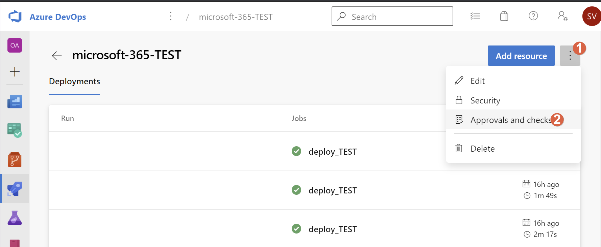
    1. Add an 'Approval' to both environments
    1. Add one or several users who need to approve the TEST phase and the RELEASE phase. You get options for serial or parallel approvals if you enter more than one user.
    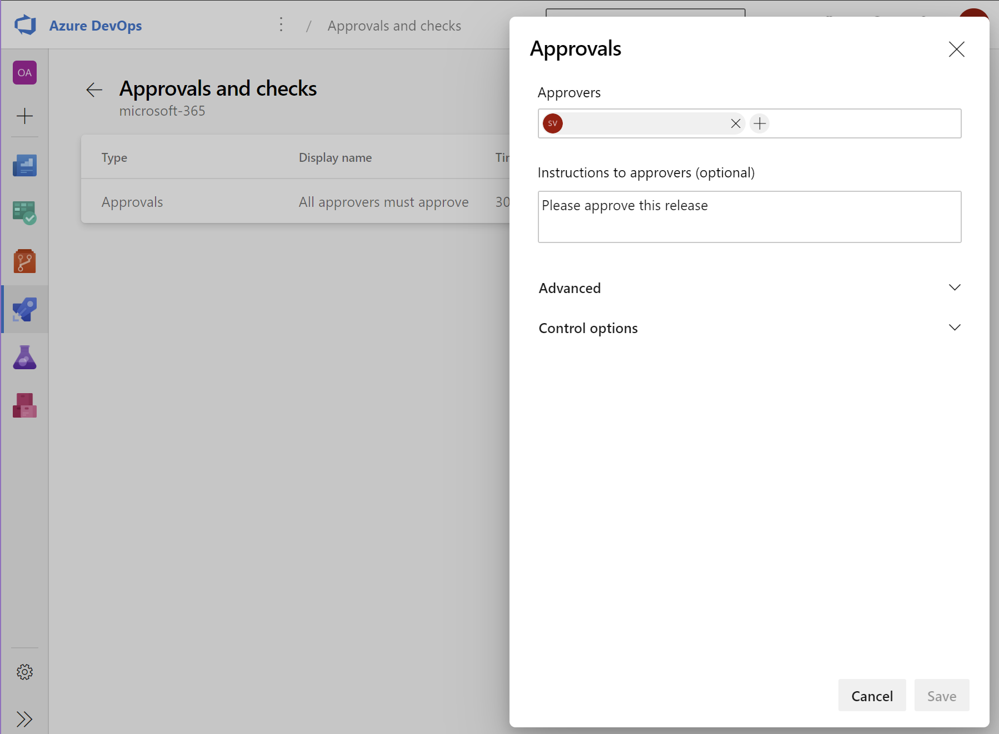
1. Add the necessary **Variable Groups** to the Pipeline **Library** settings. Call them '**M365-environment-variables**', '**M365-TEST-environment-variables**' and '**M365-PROD-environment-variables**'.:
  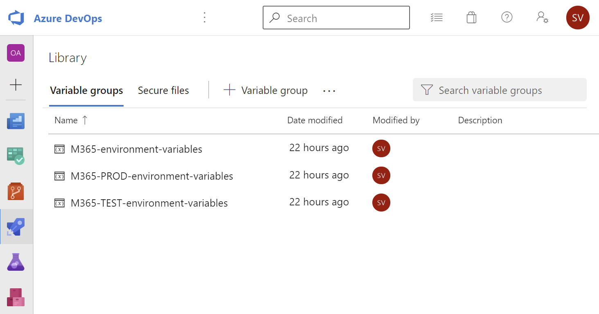
1. Create the **Variables** as shown.
1. 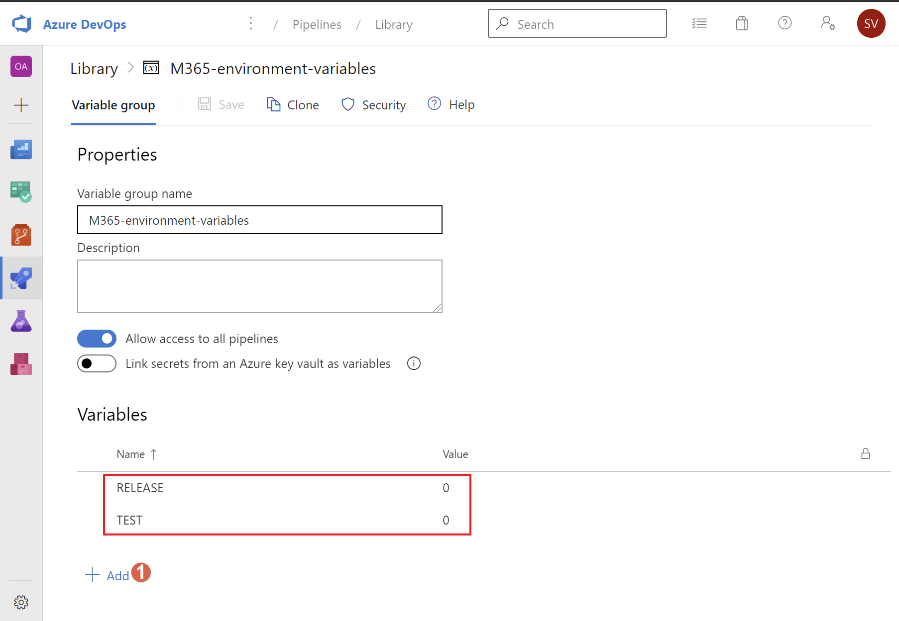
1. 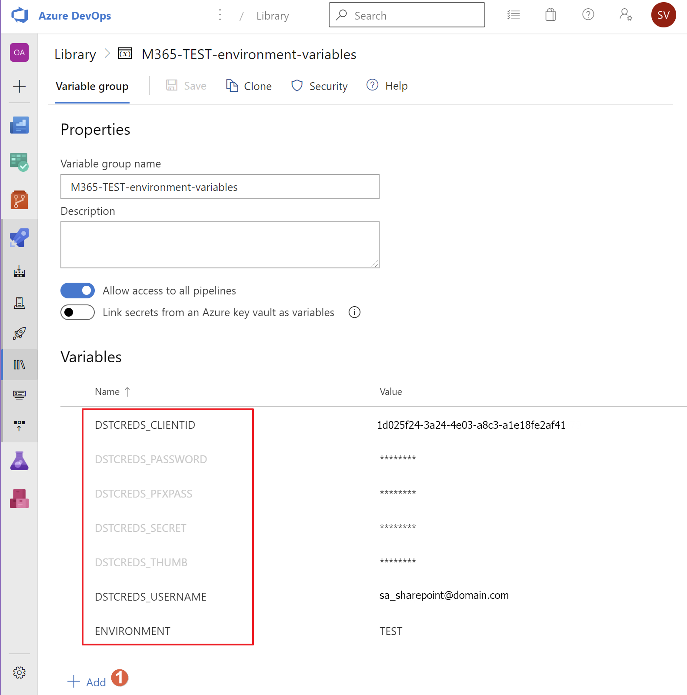
1. 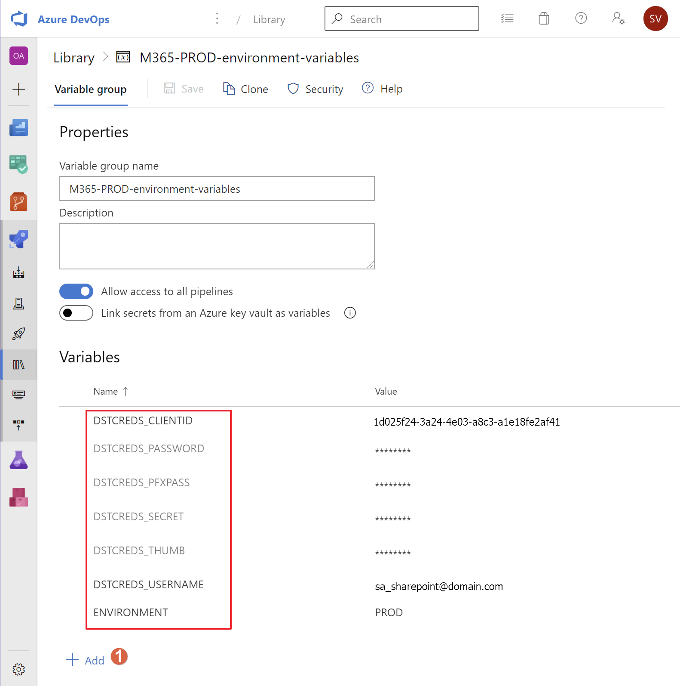
    1. The PROD and TEST groups are in need of the service account credentials (DSTCREDS_USERNAME, DSTCREDS_PASSWORD) and optionally the App Only DSTCREDS_CLIENTID, DSTCREDS_SECRET, DSTCREDS_THUMB, DSTCREDS_PFXPASS of your Microsoft 365 environment suitable for creating a PowerShell connection to SharePoint Online.
    1. even though you choose the 'PfxFile' method for authenticating, certain actions (like sending an email from within a PowerShell script) do require you to assign legitimate values to the DSTCREDS_USERNAME and DSTCREDS_PASSWORD variables as they do not support App-Only execution. These credentials can represent only a regular user without any role but with a license assigned (and a Mailbox present).
    1. If you don't have a separate PROD and TEST environments (not recommended!) just duplicate the values in the variable groups for TEST and PROD, just for the purpose of the exercise.
    1. The DSTCREDS_PASSWORD, DSTCREDS_SECRET, DSTCREDS_THUMB, DSTCREDS_PFXPASS variables should be made of type 'secure' (note the lock icon inside the Azure DevOps Library group GUI. Alternatively you could link secrets from an Azure Key vault.
1. Upload the previously generated PFX certificates (if you intend to use the 'PfxFile' method) for both TEST and PROD environments to the secure files section of the Pipeline **Library** section. File name convention should be: `[ORGANIZATION PREFIX]-[CLIENTID]-[ENVIRONMENT].pfx` (i.e. '`myclient-8c34b1e5-51d4-4470-b34d-87148e23a0df-TEST.pfx`'.
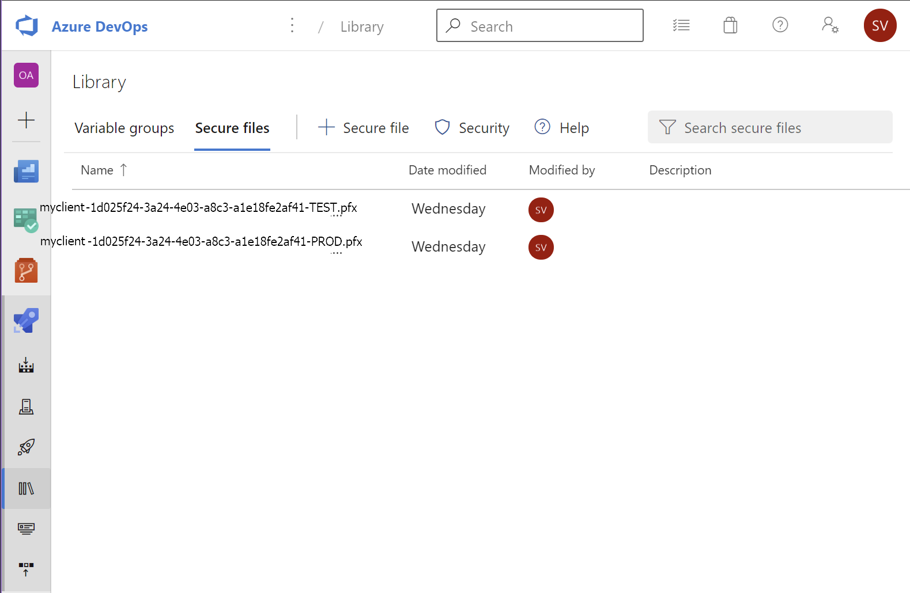
1. Adjust the tokens (text between brackets) in the `azure-pipelines.yml` file to suit your environment.

#### Run the pipeline

1. Stage, Commit and Push your changes to your Azure DevOps repository and the Azure Pipeline will be automagically configured for Continuous Deployment, which means every commit that is being pushed will trigger the pipeline. Check the appearance of the pipeline in the Azure DevOps Web Interface.

> Important: Please rename the pipeline in the Azure DevOps Web Interface to something without spaces. By default, on initial commit, the name will be something like '[ProjectName] CI'. The space in the name will cause the pipeline to fail.

### Usage

#### Test the Build and Publish stage (build_CI)

Please note as we are just running existing PowerShell scripts later on, there is nothing to be compiled or processed. Of course the build artifact containing the contents of the repository is important as it will be tagged as a 'release'.

1. Make sure both 'TEST' and 'RELEASE' variables in the 'M365-environment-variables' group are set to '0' (don't forget to save!)
    | **TEST**    = | **0** |
    | ------------- | ----- |
    | **RELEASE** = | **0** |

1. Make a small change to any file in the repository, commit and push the change.
1. If everything is properly setup the pipeline should complete successfully.
1. If any errors occur, please try and fix them. Review the [Troubleshooting](#Troubleshooting) section for more information.

#### Test the TEST stage (deploy_TEST)

1. Make sure the 'TEST' variable in the 'M365-environment-variables' group is set to '1' (don't forget to save!)
    | **TEST**    = | **1** |
    | ------------- | ----- |
    | **RELEASE** = | **0** |
1. Make a small change to any file in the repository, commit and push the change.
1. If everything is properly setup there should be an 'Approval' waiting for the person(s) you have configured the TEST environment for.
1. Finish the approval round
1. The 'deploy_TEST' stage will now commence and should finish successfully
    1. Check that the SharePoint Connection is actually established: in the 'Run Deploy Script' step it should say '`Connected to Web Target URL: <https://[yourtenant].sharepoint.com>`'
1. If any errors occur, please try and fix them. Review the [Troubleshooting](#Troubleshooting) section for more information.

#### Test the PROD stage (deploy_PROD)

1. Make sure both the 'TEST' and 'RELEASE' variables in the 'M365-environment-variables' group are set to '1' (don't forget to save!)
    | **TEST**    = | **1** |
    | ------------- | ----- |
    | **RELEASE** = | **1** |
1. Make a small change to any file in the repository, commit and push the change.
1. If everything is properly setup there should be an 'Approval' waiting for the person(s) you have configured the PROD environment for.
1. Finish the approval round
1. The 'deploy_PROD' stage will now commence where the important steps occur by means of the following extension actions:
    1. Check that the SharePoint Connection is actually established: in the 'Run Deploy Script' step it should say '`Connected to Web Target URL: <https://[yourtenant].sharepoint.com>`'
    1. 'Tag Artifacts'
        * create a tag for the release artifact for easy searching. You can find the tag with the release artifacts in the 'Azure DevOps Project / Repos / Tags' section
    1. 'Generate Release Notes'
        * create a markdown file with changes since the last release
    1. 'Add Release Notes to Wiki'
        * add the generated markdown file to the project's wiki located in the 'Azure DevOps Project / Overview / Wiki' section
1. If any errors occur, please try and fix them or contact the authors as those extension are updated regularly so mileage may vary. Review the [Troubleshooting](#Troubleshooting) section for more information.

#### Update, Expand and Add your own files

Use the given folder structure to add your own files and adding them to a 'PowerShell task' in the YAML pipeline. You can expand on the given, fairly generic and expandable structure.

### Troubleshooting

When you have issues with the extensions mentioned and configured in the pipeline start troubleshooting by setting the `System.debug` variable in the pipeline to `true` and re-run the pipeline.
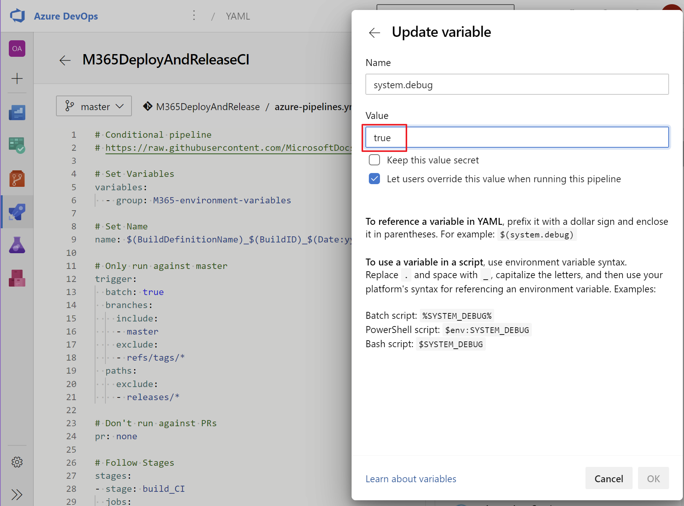

### Results

You should now have a working continuous integration pipeline running with the added bonus of a tested SharePoint connection and wiki page generation.

### Recommendations

1. Add additional pipeline automation with the [Guest User Life Cycle Management Tool](GULM-README.md).
1. Have Fun!

### Changelog

All notable changes to this project will be documented in this file.

The format is based on [Keep a Changelog](https://keepachangelog.com/en/1.0.0/),
and this project adheres to [Semantic Versioning](https://semver.org/spec/v2.0.0.html).

#### [Released]

#### [v4.3] - 2022-07-13

##### Added

* Nothing

##### Changed

* minor fixes after major release

##### Removed

* Nothing

##### Credits

#### [Released]

#### [v4.2] - 2022-07-11

##### Added

* Nothing

##### Changed

* minor fixes after major release

##### Removed

* Nothing

##### Credits

#### [Released]

#### [v4.1] - 2022-06-28

##### Added

* Nothing

##### Changed

* minor fixes after major release

##### Removed

* Nothing

##### Credits

#### [Released]

#### [v4.0] - 2022-06-27

##### Added

* Cross-platform compatibility for all scripts and documentation
* 'PfxFile' method for authenticating to M365 Services
* Azure CLI dependency (as a substitute for the deprecated AzureADPreview module)
* PnP.PowerShell module and references (as a substitute for the deprecated SharePointPnPPowerShellOnline module)
* EasyGraph module and references (as a substitute for the deprecated AzureADPreview module)

##### Changed

* the default pipeline agent to run Linux instead of Windows
* Renamed the 'Cert' method for authenticating to M365 Services to 'Thumb'

##### Removed

* All references to the SharePointPnPPowerShellOnline module
* All references to both the AzureADPreview PowerShell module and its cmdlets

##### Credits

#### [Released]

#### [v3.0] - 2020-12-28

##### Added

* Nothing

##### Changed

* Updated the GuestUserLifeCycle script and helper functions to include wait steps when switching between EXO and AAD contexts.

##### Removed

* Nothing

##### Credits

None
#### [Unreleased]

#### [v2.1] - 2020-08-06

##### Added

* Nothing

##### Changed

* Streamlined the connection process for various workloads

##### Removed

* Some references to functions that are not available in this solution.

##### Credits

None

#### [v2.0] - 2020-07-24

##### Added

* Certificate authentication option to service connect possibilities
* Azure AD connection functions
* Automatic App Principal installation with secret, thumbprint and PFX export for certificate authentication.

##### Changed

* Provided a more logical initial pipeline with 2 manual gates

##### Removed

* Nothing

##### Credits

None

#### [v1.0] - 2020-07-12

##### Added

* Initial Release

##### Changed

* Nothing

##### Removed

* Nothing

##### Credits

None
