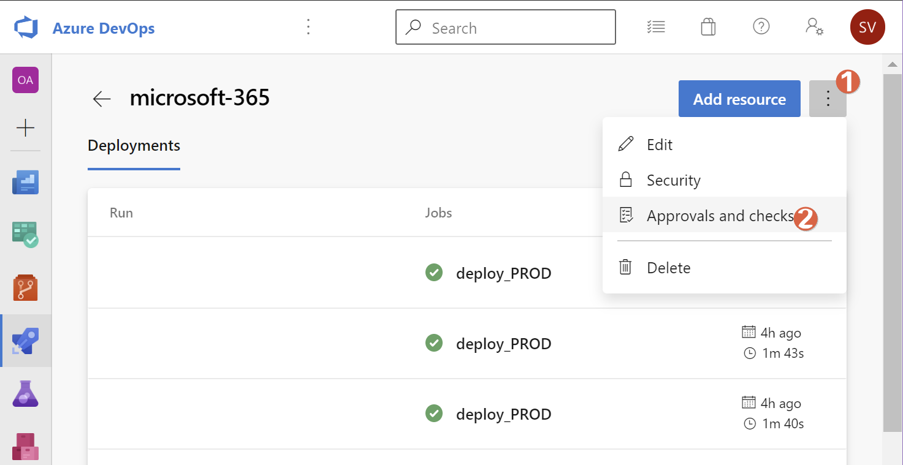
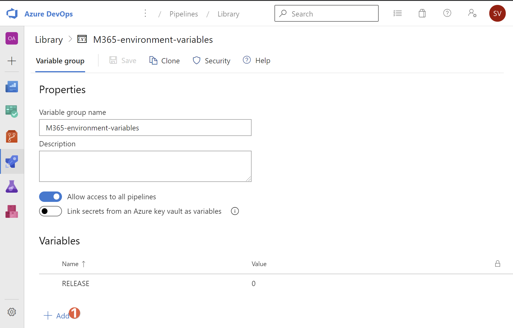
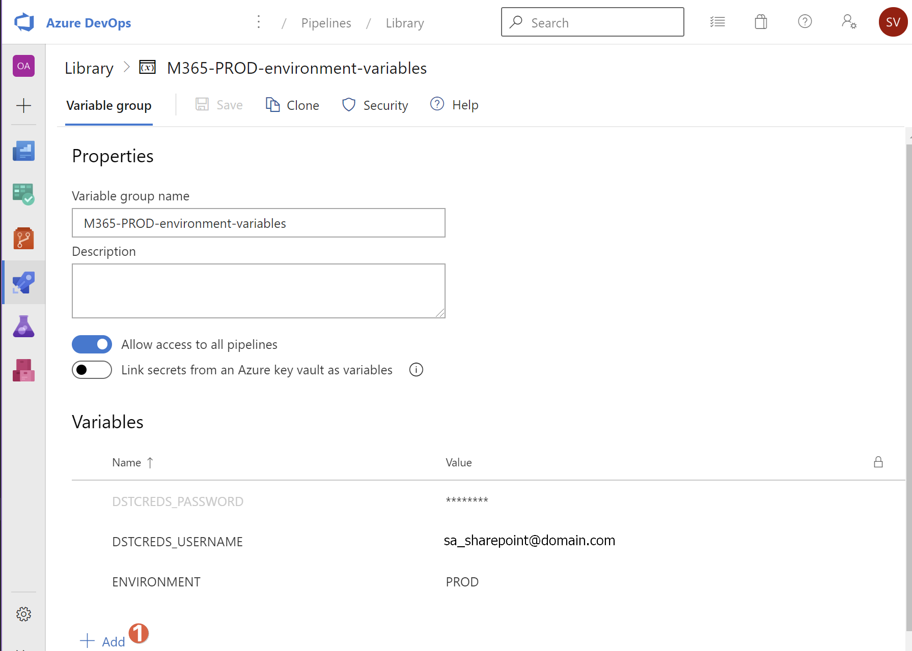
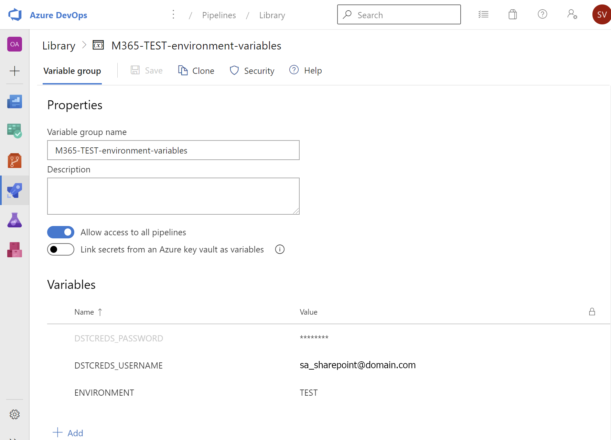

# Configuration as Code - Azure DevOps Pipeline for Microsoft 365 - Starter

## Summary

This repo brings you an expandable scaffold for continuously deploying your Microsoft 365 SaaS Configuration with a basic 'conditional' multi stage yaml pipeline for Azure Pipelines. The pipeline uses a manual Approval step, before creating a release. This pipeline simply automates a connection to SharePoint Online and can than be expanded upon.

To keep things simple git branching is not being used, all commit/push actions should take place on the 'master' branch. Adapt this solution accordingly.

## Known Issues

None

## Requirements

* Your own Azure DevOps organization, preferably linked to your Azure AD organization.
* These Azure DevOps extensions installed in your Azure DevOps organization:
  * 1 [Tag\Branch Git on Release](https://marketplace.visualstudio.com/items?itemName=jabbera.git-tag-on-release-task&targetId=1984fc0e-1ed4-4122-8e14-c4622047929a&utm_source=vstsproduct&utm_medium=ExtHubManageList)
  * 2 [Generate Release Notes (Crossplatform)](https://marketplace.visualstudio.com/items?itemName=richardfennellBM.BM-VSTS-XplatGenerateReleaseNotes&targetId=1984fc0e-1ed4-4122-8e14-c4622047929a&utm_source=vstsproduct&utm_medium=ExtHubManageList)
  * 3 [WIKI Updater Tasks](https://marketplace.visualstudio.com/items?itemName=richardfennellBM.BM-VSTS-WIKIUpdater-Tasks&targetId=1984fc0e-1ed4-4122-8e14-c4622047929a&utm_source=vstsproduct&utm_medium=ExtHubManageList)
* If the included Powershell scripts need to be run locally:
  * Only Windows 7+ with WMI 5.1 is supported (Prefer Windows 10)
  * [PnP Powershell](https://github.com/pnp/PnP-PowerShell#installation) module needs to be installed

## Installation

1. Start by importing this GitHub repository in any Azure DevOps repository you desire to start using your scaffold.
1. Install the extensions mentioned in [Requirements](#Requirements) in your Azure DevOps organization
1. Make sure your Project Build account has 'Contribute' permissions to the Project Wiki.
    
1. Add a Pipeline **Environment** called 'microsoft-365'
  
    1. Add an 'Approval' to the environment
    1. Add one or several users who need to approve the release. You get options for serial or parallel approvals if you enter more than one user.
    
1. Add the necessary **Variable Groups** to the Pipeline **Library** settings. Call them '**M365-environment-variables**', '**M365-PROD-environment-variables**' and '**M365-TEST-environment-variables**'.:
  
1. Create the **Variables** as shown inputting the service account credentials of your Microsoft 365 environment suitable for creating a Powershell connection to SharePoint Online. If you don't have a separate PROD and TEST environments (not recommended!) just duplicate the values. Usually an account with the SharePoint Admin role would suffice. The Password variable should be made of type 'secret'. Alternatively you could link secrets from an Azure Key vault.
    1. 
    1. 
    1. 
1. Adjust the tokens (text between brackets) in the `azure-pipelines.yml` file to suit your environment (line 138). This line represent the Uri of the wiki repository.
1. At least adjust the `environmentMain.customerO365TenantPrefix` and `environmentMisc.credentialTarget` keys in both `_Environment_PROD.jsonc` and `_Environment_TEST.jsonc` files accordingly, matching your environment.
1. If you plan to execute the script `Scripts\M365\6. Deployment\Test-Deployment.ps1` locally: Add the referenced **Generic** Credentials (not the Windows Credentials) to the Windows Credential Manager
    
    
1. Stage, Commit and Push your changes to your Azure DevOps repository and the Azure Pipeline will be automagically configured for Continuous Deployment, which means every commit that is being pushed will trigger the pipeline. Check the appearance of the pipeline in the Azure DevOps Web Interface.

> Important: Please rename the pipeline in the Azure DevOps Web Interface to something without spaces. By default, on initial commit, the name will be something like '[ProjectName] CI'. The space will cause the pipeline to fail.

## Usage

### Test the Build and Publish stage (build_CI)

Please note as we are just running existing Powershell scripts later on, there is nothing to be compiled or processed. Of course the build artefact containing the contents of the repository is important as it will be tagged as a release.

1. Make sure the 'RELEASE' variable in the 'M365-environment-variables' group is set to '0' (don't forget to save!)
    | **RELEASE** = | 0 |
    | ------------- | - |
1. Make a small change to any file in the repository, commit and push the change.
1. If everything is properly setup the pipeline should complete successfully.
1. If any errors occur, please try and fix them. Review the [Troubleshooting](#Troubleshooting) section for more information.

### Test the release stage for TEST and PROD (deploy_TEST, deploy_PROD)

1. Make sure the 'RELEASE' variable in the 'M365-environment-variables' group is set to '1' (don't forget to save!)
    | **RELEASE** = | 1 |
    | ------------- | - |
1. Make a small change to any file in the repository, commit and push the change.
1. If everything is properly setup there should be an 'Approval' waiting for the person(s) you have configured the environment for.
1. Finish the approval round
1. The 'deploy_TEST' stage will now commence and should finish successfully
    1. Check that the SharePoint Connection is actually established: in the 'Run Deploy Script' step it should say 'Connected to Web Target URL: <https://[yourtenant].sharepoint.com>'
1. The 'deploy_PROD' stage will now commence where the important steps occur by means of the following extension actions:
    1. Check that the SharePoint Connection is actually established: in the 'Run Deploy Script' step it should say 'Connected to Web Target URL: <https://[yourtenant].sharepoint.com>'
    1. 'Tag Artifacts'
        * create a tag for the release artifact for easy searching
    1. 'Generate Release Notes'
        * create a markdown file with changes since the last release
    1. 'Add Release Notes to Wiki'
        * add the markdown file to the project's wiki
1. If any errors occur, please try and fix them or contact the authors as those extension are updated regularly so millage may vary. Review the [Troubleshooting](#Troubleshooting) section for more information.

### Troubleshooting

Start troubleshooting by setting the `System.debug` variable in the pipeline to `true` and re-run the pipeline.
  

### Update, Expand and Add your own files

Use the given folder structure to add your own files and adding them to a 'powershell task' in the yaml pipeline. You can expand on the given, fairly generic and expandable structure.

## Results

You should now have a working continuous integration pipeline running with the added bonus of a tested SharePoint connection and wiki page generation.

## Recommendations

Have Fun!

## Changelog

All notable changes to this project will be documented in this file.

The format is based on [Keep a Changelog](https://keepachangelog.com/en/1.0.0/),
and this project adheres to [Semantic Versioning](https://semver.org/spec/v2.0.0.html).

### [Unreleased]

### [1.0.0] - 2020-07-12

#### Added

* Initial Release

#### Changed

* Nothing

#### Removed

* Nothing

## Credits

None
